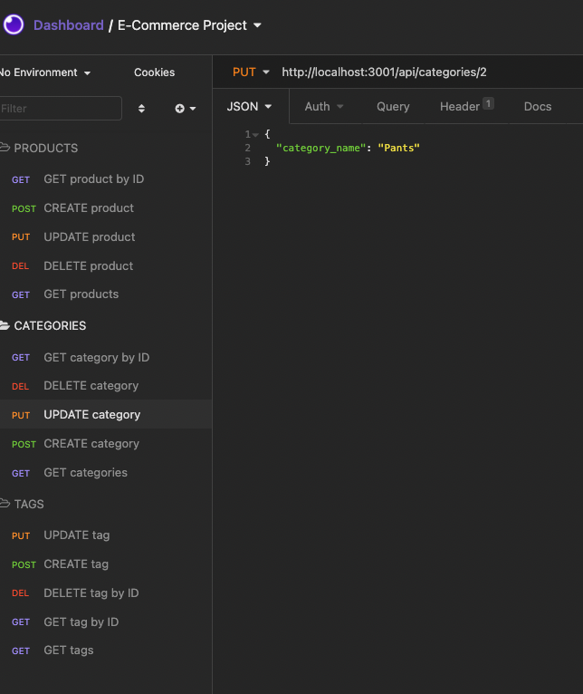
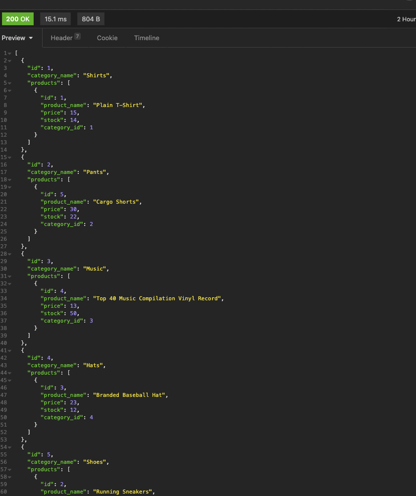

# Epic E-Commerce Backend

## Description
Backend application for e-commerce site

[Video of application walkthrough](https://watch.screencastify.com/v/ksBygQY6MacVHtQt2Zld)

## Table of Contents
1. [Installation](#installation) 
2. [Usage](#usage)
3. [Contributing](#contributing)
4. [Tests](#tests)
5. [Screenshots](#Screenshots)

## Installation 
You’ll need to use the [MySQL2](https://www.npmjs.com/package/mysql2) and [Sequelize](https://www.npmjs.com/package/sequelize) packages to connect your Express.js API to a MySQL database and the [dotenv](https://www.npmjs.com/package/dotenv) package to use environment variables to store sensitive data.
## Usage 
Internet retail, also known as **e-commerce**, is the largest sector of the electronics industry, generating an estimated $29 trillion in 2019. E-commerce platforms like Shopify and WooCommerce provide a suite of services to businesses of all sizes. We can use this app to track products, tags, and categories of items.

## User Story

```md
AS A manager at an internet retail company
I WANT a back end for my e-commerce website that uses the latest technologies
SO THAT my company can compete with other e-commerce companies
```

## Acceptance Criteria

```md
GIVEN a functional Express.js API
WHEN I add my database name, MySQL username, and MySQL password to an environment variable file
THEN I am able to connect to a database using Sequelize
WHEN I enter schema and seed commands
THEN a development database is created and is seeded with test data
WHEN I enter the command to invoke the application
THEN my server is started and the Sequelize models are synced to the MySQL database
WHEN I open API GET routes in Insomnia Core for categories, products, or tags
THEN the data for each of these routes is displayed in a formatted JSON
WHEN I test API POST, PUT, and DELETE routes in Insomnia Core
THEN I am able to successfully create, update, and delete data in my database
```
## Contributing 
Chandra Holt contributed to this project
## Tests 
INSOMNIA used to test API routes
## Screenshots 



### GitHub
[GitHub](https://www.github.com/chandrapanda) 
### Email
chandra_holt@hotmail.com
## License 
  [](https://opensource.org/licenses/MPL-2.0)
  [This application is licensed under Mozilla](https://opensource.org/licenses/MPL-2.0)

